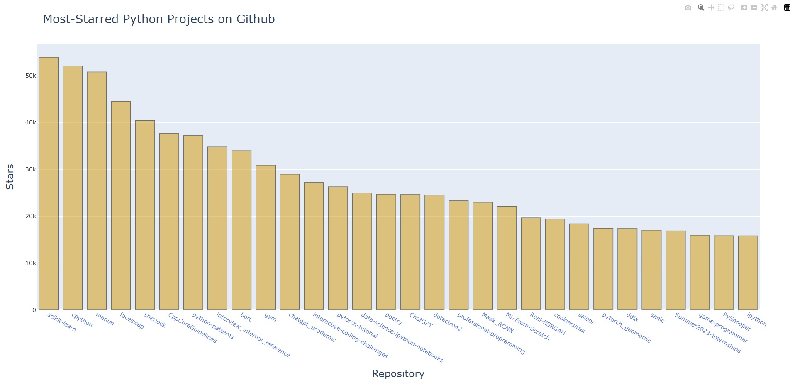
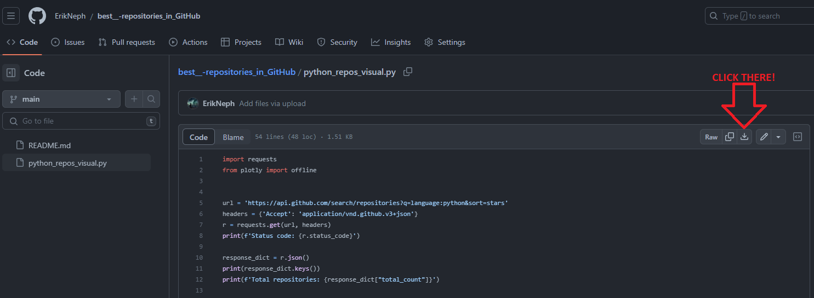
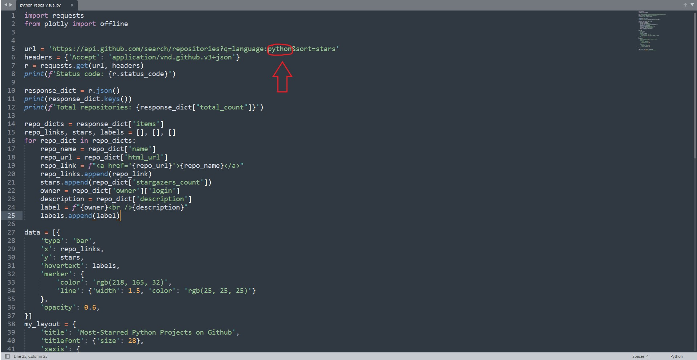
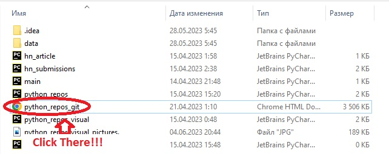
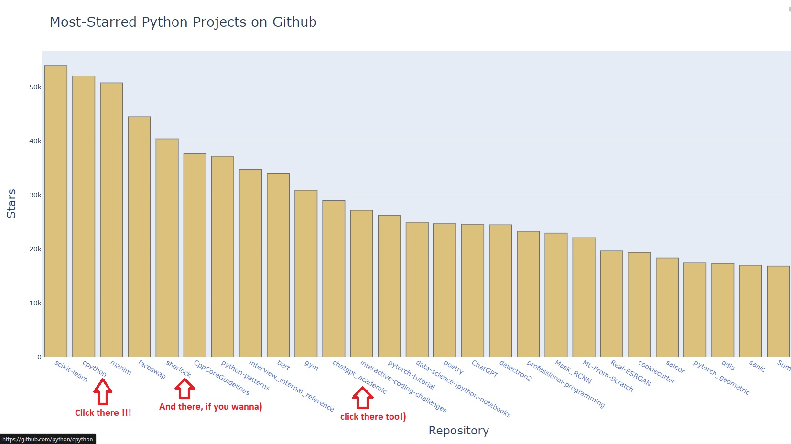

# Best_repositories_in_GitHub
Data visualization with Plotly , request and API.

Written in Python.

Data visualization of the best repositories on Github in 5 steps.👌

• 1 Step: Download this file python_repos_visual.py!

• 2 Step: Access the downloaded file using your favorite IDE (Pycharm, Vim, VsCode, SublimeText and etc.).

• 3 Step: Before interpreting the file, you can change the search for the best Python repositories to another language of your consideration, (For example: C#, C, Java, Go). It is enough to change the line in the python_repos_visual.py file from python to another programming language. Don't forget to download the plotly library!!! If you do not have it installed in the Python interpreter.

• 4 Step: The file is interpreted. If you did everything right. Then the file python_repos_git.html will appear in the folder where your python_repos_visual.py file is located, open it with your favorite browser. And "Voila done", you can also click on the repository links, after clicking you will be on the GitHub of the repository you need.

• 5 Step: Finally, you can see a histogram in the HTML file, and a lot of links to these repositories.
Just click on any of the links and you will be taken to the main page of that GitHub repository.

